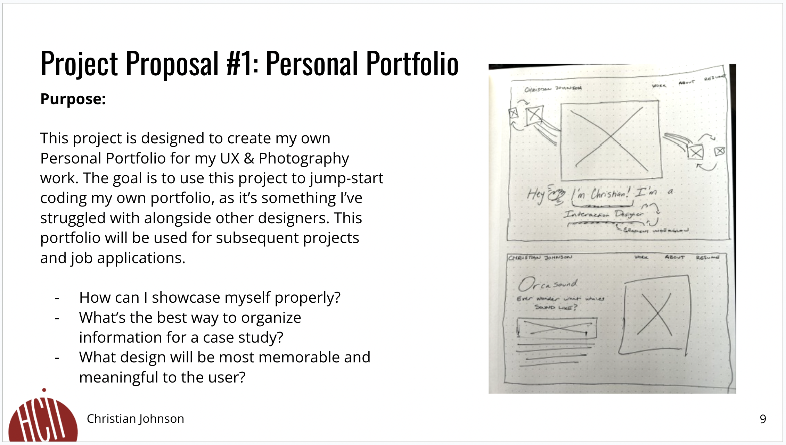
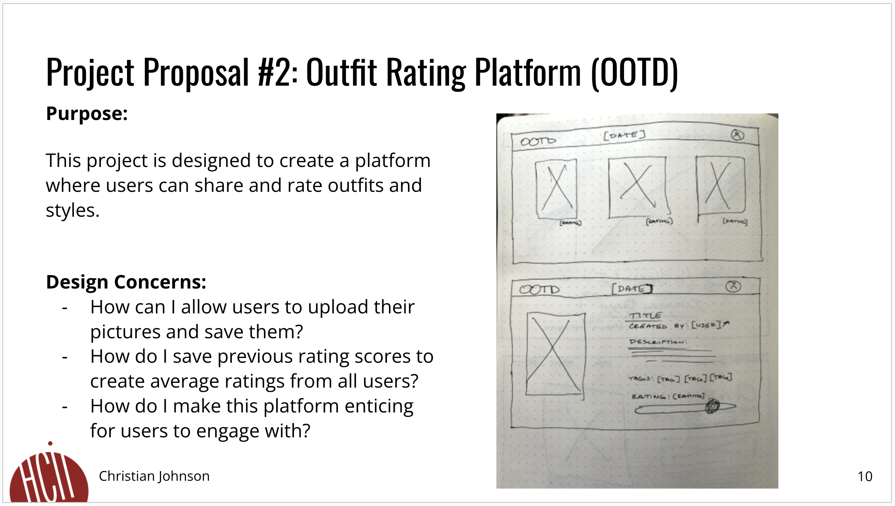
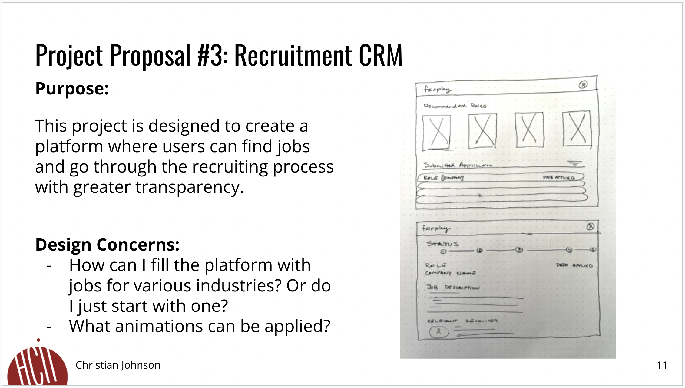

# **FP1 \- Proposal for Critique**

## Idea Sketches

### *Idea 1*

This project is designed to create my own Personal Portfolio for my UX & Photography work. The goal is to use this project to jump-start coding my own portfolio, as it’s something I’ve struggled with alongside other designers. This portfolio will be used for subsequent projects and job applications.

I plan on making including animations within this project in order to make it interactive. The use of color will also be implimented in order to not only make the page visually appealing, but create hierarchy as well.

In order to make this design accessible, I'll be adhering to the WCAG guidelines and practices. There are also been talks off adding a day/night mode for contrast variations.

### *Idea 2*

This project is designed to create a platform where users can share and rate outfits and styles.

* By including a rating scale, clickable links and images, the platform comes alive with interactivity.
* In order to make this design accessible, I'll be adhering to the WCAG guidelines and practices. There are also been talks off adding a day/night mode for contrast variations.
### *Idea 3*

This project is designed to create a platform where users can find jobs and go through the recruiting process with greater transparency.

* Users can interact with this platform by clicking on the recommended job postings, viewing the roles they've already submitted, or clicking a link to a connect with a relavant recruiter on LinkedIn.
* In order to make this design accessible, I'll be adhering to the WCAG guidelines and practices. There are also been talks off adding a day/night mode for contrast variations.

## Feedback Summary

### Personal Portfolio
There was feedback concerning the animations. Animations could make the page look distracting and take away from the aesthetics and overall usability in terms of performance. 

### Outfit Rating Platform (OOTD)
With this idea being a platform, the feedback was moreso geared towards social features. One feature that was proposed was to be able to save other people's outfits as inspiration or for moodboards. However in terms of being built, there is a concern with how to upload and save pictures. Buying servers and storage might be outside the scope of this project.

### Recruitment CRM (fairplay)
Trying to create a CRM is not easy. And even less so for jobs application. There will be a lot of connections to different web APIs like LinkedIn and Indeed.

## Feedback Digestion

Based on the feedback I've received, I've chosen to take on the Personal Portfolio as my final project. This project allows me to exercise my HTML, CSS, and JavaScript ailities while learning new frameworks like React. There are ways to mitigate animations while keeping performance. I'm excited to take this project onboard and really look forward to the final result!

# **FP2 \- Evaluation of the Final project**

## Project Description

This project is designed to create my own Personal Portfolio for my UX & Photography work. The goal is to use this project to jump-start coding my own portfolio, as it’s something I’ve struggled with alongside other designers. This portfolio will be used for subsequent projects and job applications.

## High-Fi Prototypes

### *Prototype 1*

### *Prototype 2*

## Usability Test

The user feedback is as follows:
* Visually appealing
* “I like how the description changes but I’m still able to read it.”
* “The dark version allows me to view this website in low light places.”
* Like the rotate button so that the user has a chance to read at their own pace
* The possibility of switching from dark mode to light mode
* Incorporate the “rotate button” on both the light and dark modes
* The work looks really generic. You’re a designer, make it true to you

## Feedback Summary

The portfolio demonstrates strong foundational skills, though there are areas for improvement that could elevate its impact. The portfolio showcases a solid understanding of design principles, and the projects are visually appealing, with a clear layout that makes them easy to navigate. However, there is limited emphasis on the design process, which is critical to convey how design decisions were made. Including more insights into each project's research, ideation, and user testing phases would highlight problem-solving skills and demonstrate a user-centered approach. Additionally, while the visuals are polished, they sometimes lack annotations that explain specific choices, making it harder for viewers to understand the rationale behind design elements. Adding concise explanations or captions could make the portfolio feel more intentional and structured. Finally, focusing on fewer, more detailed case studies rather than a broad selection of projects could provide a deeper look at the candidate's skills and thought processes, ultimately making a stronger impression. Overall, the portfolio shows potential, but with a few enhancements, it could more effectively communicate both the designer’s capabilities and their approach to solving user experience challenges.

## Milestones

Outline weekly milestones to plan your expected implementation progress until the end of the semester (\~300 words). 

### *Implementation Plan*

- [X] Week 9 Oct 28 \- Nov 1:
  - [X] FP1 Due
  - [X] Choose the final direction of the project based on feedback and feasibility.
  - [X] Develop lo-fi prototypes to explore different design layouts and features.
  - [X] Create two hi-fi prototypes, incorporating essential UI elements.
  - [X] Conduct the first round of usability testing to gather early insights.
  
- [X] Week 10 Nov 4 \- Nov 8:   
  - [X] FP2 Due
  - [X] Create wireframes and lo-fi prototypes based on the feedback from 11/3. This will serve as a general outline for the larger platform to come.
  - [ ] Refine the Figma prototype, incorporating interactive elements. This will serve as the basis for core concept of the portfolio.

- [ ] Week 11 Nov 11 \- Nov 15:  
  - [ ] Complete HTML template for the map and phrases pages before JS implementation.
  - [ ] Apply CSS to replicate the styling in the Figma prototype.
    - [ ] Outline components and define reusable styles

- [ ] Week 12 Nov 18 \- Nov 22:
  - [ ] FP3 Due   
  - [ ] Set up JavaScript libraries necessary for interactive features, such as rotating text animations and dark mode/light mode.
  - [ ] Implement the functionality for hovering over Projects
  - [ ] Develop the tag functionality on the Works/Projects page
  - [ ] Create wireframe and lo-fi prototype for Project pages. This will be used to create multiple pages based on selections.

- [ ] Week 13 Nov 25 \- Nov 29:  
  - [ ] Finalize the filter/tag functionality on the Works/Projects page, enabling employers to refine their interests by tags.
  - [ ] Create a simple About Page
  - [ ] Thanksgiving
    - [ ] buffer for catching up or refining previously completed tasks.

- [ ] Week 14 Dec 2 \- Dec 6:  
  - [ ] Complete styling for mobile breakpoints.
  - [ ] Perform comprehensive testing for responsiveness and semantic structure, addressing any accessibility issues.
  - [ ] FP4 due 

### *Libraries and Other Components*

* Anime.js ([https://animejs.com/])
* React.js

## Generative AI Use Plan

### 1. Ideation and Planning
AI will aid in the initial brainstorming and planning stages by generating ideas, suggesting potential frameworks, and identifying suitable design patterns. By prompting AI with high-level project goals, I can explore different approaches to structuring the solution and break down complex requirements into manageable tasks. This will help establish a clear roadmap before coding begins.

### 2. Code Generation and Development
AI’s code generation capabilities will streamline development by providing syntax-correct code snippets and boilerplate templates. By prompting AI for functions, classes, or logic flows, I can quickly establish foundational code structures and complete repetitive tasks efficiently. These suggestions will be further adapted, tested, and optimized to fit the specific needs of the project.

### 3. Debugging and Optimization
AI will play a key role in debugging and optimizing the code. It can analyze code segments, identify potential errors, and suggest corrections, allowing me to resolve issues faster. Additionally, AI can recommend alternative, more efficient algorithms, enhancing the overall performance of the application. This functionality will be especially useful in the iterative testing phase to ensure code reliability.

### 4. Documentation and Code Review
Documentation is essential for code readability and future maintenance. AI can assist by generating clear explanations and summaries for various functions and classes, making it easier to maintain comprehensive documentation. It will also serve as a virtual reviewer by analyzing the code structure and highlighting potential improvements.

### *Tool Use*

* GitHub Copilot
    * GitHub Copilot is an AI-powered code completion tool developed by GitHub.
    This project will leverage GitHub Copilot to assist with ideation, code generation, debugging, and documentation throughout the development process.

### *Responsible Use*

The Responsible Use of Generative AI is paramount to this project. Comments will
left in the code files, denoting when and where Generative AI has been used.

---

# **FP3 \- Final Project Check-in**

Document the changes and progress of your project. How have you followed or changed your implementation & GenAI use plan and why? Remember to commit your code to save your progress.

## Implementation Plan Updates

- [X] Week 9 Oct 28 \- Nov 1:
  - [X] FP1 Due
  - [X] Choose the final direction of the project based on feedback and feasibility.
  - [X] Develop lo-fi prototypes to explore different design layouts and features.
  - [X] Create two hi-fi prototypes, incorporating essential UI elements.
  - [X] Conduct the first round of usability testing to gather early insights.
  
- [X] Week 10 Nov 4 \- Nov 8:   
  - [X] FP2 Due
  - [X] Create wireframes and lo-fi prototypes based on the feedback from 11/3. This will serve as a general outline for the larger platform to come.
  - [X] Refine the Figma prototype, incorporating interactive elements. This will serve as the basis for core concept of the portfolio.

- [X] Week 11 Nov 11 \- Nov 15:  
  - [X] Complete HTML template for the map and phrases pages before JS implementation.
  - [X] Apply CSS to replicate the styling in the Figma prototype.
    - [ ] Outline components and define reusable styles

- [ ] Week 12 Nov 18 \- Nov 22:
  - [X] FP3 Due   
  - [ ] Set up JavaScript libraries necessary for interactive features, such as rotating text animations and dark mode/light mode.
  - [ ] Implement the functionality for hovering over Projects
  - [ ] Develop the tag functionality on the Works/Projects page
  - [ ] Create wireframe and lo-fi prototype for Project pages. This will be used to create multiple pages based on selections.

- [ ] Week 13 Nov 25 \- Nov 29:  
  - [ ] Finalize the filter/tag functionality on the Works/Projects page, enabling employers to refine their interests by tags.
  - [ ] Create a simple About Page
  - [ ] Thanksgiving
    - [ ] buffer for catching up or refining previously completed tasks.

- [ ] Week 14 Dec 2 \- Dec 6:  
  - [ ] Complete styling for mobile breakpoints.
  - [ ] Perform comprehensive testing for responsiveness and semantic structure, addressing any accessibility issues.
  - [ ] FP4 due 

## Generative AI Use Plan Updates

- No updates. Generative AI has not been used so far.

Remember to keep track of your prompts and usage for [FP4 writeup](#part-6-generative-ai-use-and-reflection).

---